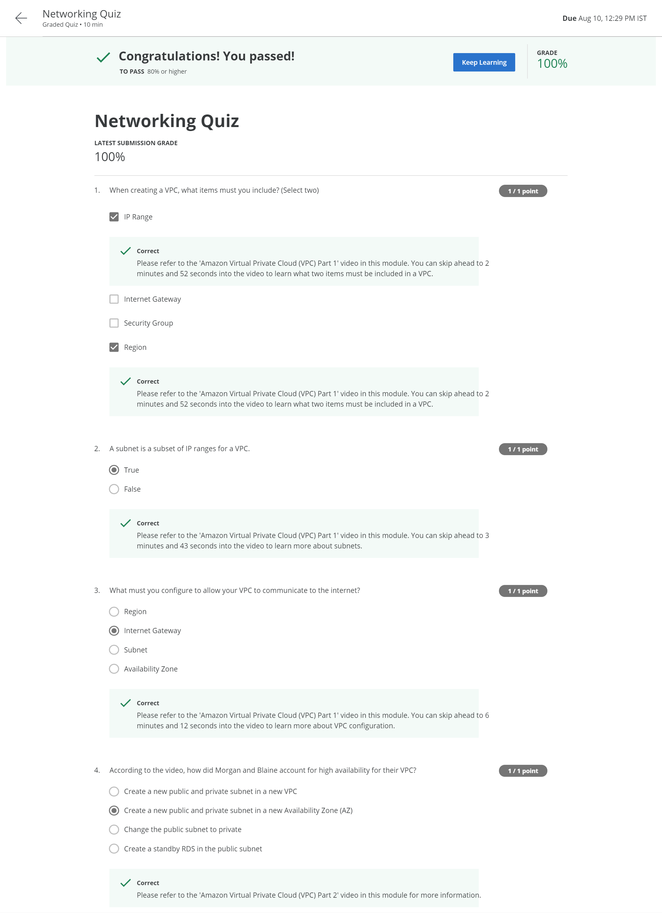

# Key Concepts
* Describe Networking on AWS
* Differentiate between Object and Block Storage
* Describe the different use cases for Amazon S3, Amazon EBS, Amazon EFS

## Networking Quiz. Graded Quiz • 10 min

# Storage on AWS
## Introduction to Storage on AWS
* Storage is one of the most important part of any application. For our directory application we are storing images on S3, names and location in RDS and static HTML files on webserver.
* S3: object lavel storage. In case of object level storage, to update or change the object we have to change the entire object. For e.g. changing the image
* RDS: Block level storage. Relational databases are block level storage where we can change perticular block in a datafile. for.e.g changing the location for a user.
* So S3 is more suitable for images, videos, text files etc and rest all we can use RDS

